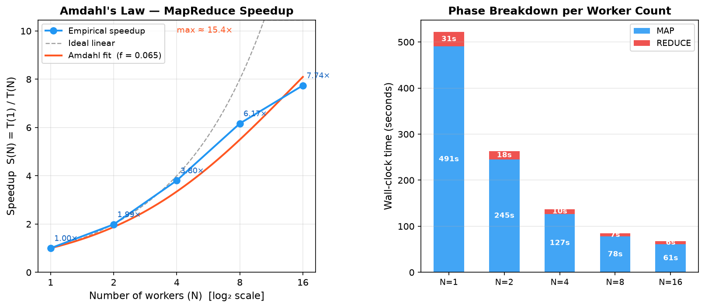
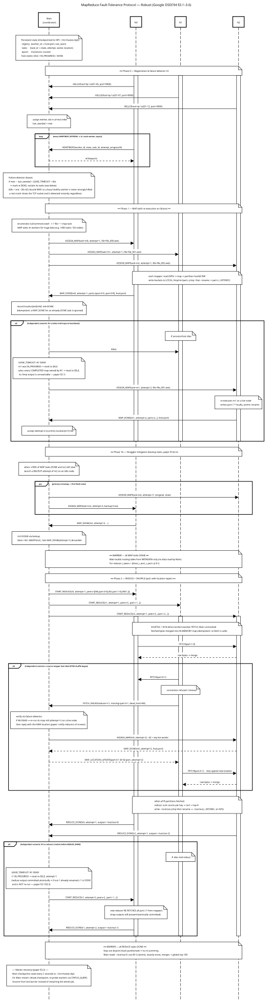

# Distributed Computing Project

> Design and implementation of a distributed MapReduce engine, deployed directly on Télécom Paris lab machines and evaluated on Common Crawl data.

[](https://www.python.org/)
[](https://commoncrawl.org/)

Distributed systems project completed by a team of four students at Télécom Paris. We designed and deployed a MapReduce engine directly on the school's lab machines, using real networked resources rather than a simulated cluster or containerized environment. The goal was to build and evaluate a data-processing pipeline distributed across several machines, without relying on Hadoop, HDFS, Docker, ZooKeeper, or root privileges.

The result is a MapReduce engine written primarily in Python. It processes Common Crawl splits with explicit synchronization between the `MAP`, `SHUFFLE`, and `REDUCE` phases. The project also covers automated deployment, performance measurement, validation against a sequential reference, and worker failure recovery.



*Measured speedup on a fixed dataset of 16 Common Crawl splits with 8 reducers.*

## Results at a glance

| Dimension | Result |
| --- | --- |
| **Scalability** | **7.74x** speedup with 16 workers, reducing total time from 521.66 s to 67.37 s |
| **Correctness** | All four analyses are compared against a key-by-key single-machine computation |
| **Fault tolerance** | A worker can be killed during execution; its tasks are detected and reassigned |
| **Optimization** | Shuffle accelerated through local aggregation and parallel SSH transfers |
| **Reproducibility** | Local test suite runs without a cluster or SSH server |
| **Data** | One real split containing 62.9 MB of decompressed text and 6.6 million tokens |

## Why this project matters

This project addresses several problems found in production distributed data systems:

- designing a protocol between a coordinator and workers;
- distributing computation while retaining an independent correctness reference;
- reasoning about shared storage, local disks, and network costs;
- measuring bottlenecks instead of assuming that parallelism is sufficient;
- handling slow or failed workers without corrupting the final result;
- experimentally comparing performance with Amdahl's law.

The project was built from low-level components: TCP sockets, JSON Lines messages, Python processes, SSH/SCP, NFS, and Bash scripts. This constraint makes design choices visible that are usually hidden by a distributed framework.

## Architecture

The system is organized around a **master** and multiple **workers**.


### Job execution

1. The master splits the input into MAP tasks and assigns them to available workers.
2. Each worker reads its split, tokenizes the data, and locally aggregates keys.
3. Keys are assigned to reducers with `crc32(key) % number_of_reducers`.
4. A phase barrier ensures that REDUCE starts only after the required MAP tasks finish.
5. Reducers remotely read intermediate partitions, aggregate them, and write final results.
6. The validator compares the distributed output against a sequential reference.

### Implementation choices

- **Control plane**: TCP and JSON messages delimited by `\\n`.
- **Shuffle**: intermediate partitions read through `ssh cat`, parallelized with `ThreadPoolExecutor`.
- **Storage**: MAP intermediates on local disk (`/tmp` or scratch), final results on shared storage.
- **Deployment**: machine selection, SCP copy, SSH startup, and automated cleanup.
- **Results**: write to a temporary file followed by an atomic `os.replace()`.
- **Observability**: structured logs and separate timings for deployment, I/O, MAP, synchronization, shuffle, and REDUCE.

## Features

### Four analysis jobs

The same engine supports several reduction functions, selected with the `-j` option:

| Job | Description |
| --- | --- |
| `wordcount` | Frequency of each word |
| `lang` | Approximate language ranking using stop words |
| `wordlen` | Distribution of word lengths |
| `bigram` | Frequency of consecutive word pairs |

### Three Common Crawl ingestion strategies

- **Pre-download** splits to shared storage.
- **On-demand download** to local storage.
- **Direct read** from S3/HTTPS into memory, without an intermediate NFS file.

The third strategy reduces pressure on shared storage, but makes each MAP retry dependent on the availability and bandwidth of the external service. This trade-off is measured and documented in the report.

### Fault tolerance



The master tracks worker state through heartbeats sent every two seconds and a 60-second lease. A socket closure also enables fast crash detection. When a task is lost:

- an in-progress MAP or REDUCE task can be retried;
- completed MAP tasks are recomputed if their worker disappears;
- completed reducers are preserved through atomic writes;
- speculative tasks reduce the impact of stragglers;
- stale attempts are ignored so an old execution cannot overwrite a newer result.

This logic is tested by actually killing a worker during a job, both locally and on the cluster.

## Performance and optimization

Measurements guided the optimizations rather than the other way around.

### Multi-node speedup

Amdahl sweep on the same dataset of 16 splits and 8 reducers:

| Workers | Total time | Speedup |
| ---: | ---: | ---: |
| 1 | 521,66 s | 1,00x |
| 2 | 262,80 s | 1,99x |
| 4 | 137,15 s | 3,80x |
| 8 | 84,60 s | 6,17x |
| 16 | 67,37 s | **7,74x** |

The adjusted sequential fraction is estimated at approximately `6.5%`, giving a theoretical ceiling close to `15.4x`. The gap between this ceiling and the measured result exposes deployment, synchronization, and communication costs.

### Measured optimizations

- tokenization directly on bytes;
- local aggregation before partitioning, acting as a combiner;
- computing CRC32 once per unique key;
- batched partition writes;
- parallel shuffle using a thread pool;
- SSH connection multiplexing through `ControlMaster`;
- direct Common Crawl reads to avoid NFS contention.

Across 32 splits, local aggregation reduces shuffle time by approximately 4 to 5 times, while parallel shuffle adds another factor of 5 to 8 depending on the configuration. The best documented total Python time drops from approximately 53.5 s to 35.1 s.

## Validation and reproducibility

Correctness does not rely solely on an exit code. The validator recomputes the results on one machine and checks:

- the number of distinct keys;
- the total number of occurrences;
- the value of every key in the distributed output against the reference.

### Local test without a cluster

The harness launches the same master and workers as local processes. Only the shuffle transport is replaced with local disk reads; the computation engine remains unchanged.

```bash
pip install -e .
python3 tests/run_all.py
```

For a quick run:

```bash
python3 tests/run_all.py --quick
```

The suite covers all four jobs, validation against the single-machine reference, a worker failure test, and a small Amdahl sweep. Exit code `0` indicates that all checks passed.

### Cluster demonstration

With SSH access to the Télécom Paris lab machines:

```bash
pip install -e .
bash src/deploy/deploy_commoncrawl.sh -w 8 -r 8 -s 8 -j wordcount
ssh tp-XXXX "python3 ~/slr207-group1-commoncrawl-\$USER/validate.py \\
  -i ~/slr207-group1-commoncrawl-\$USER/input \\
  -o ~/slr207-group1-commoncrawl-\$USER/output -j wordcount -s 8"
bash src/deploy/kill_commoncrawl.sh
```

The fault-recovery demonstration is available with:

```bash
bash src/deploy/fault_tolerance_demo.sh -n 1
```

The local mode validates computation and recovery logic, while the cluster is required to measure the actual cost of multi-node SSH shuffle.

## Batch / streaming comparison

A complementary demonstration compares the MapReduce engine with a Kafka Streams pipeline:

```bash
bash src/kafka/deploy_kafka.sh
bash src/kafka/run_wordcount.sh --crawl CC-MAIN-2024-10 --index 0
bash src/kafka/clean_kafka.sh
```

The MapReduce engine processes a finite input and produces a final result. Kafka Streams maintains an evolving result in a topic. Kafka is deployed in KRaft mode, without Docker, root, or ZooKeeper. The project orchestrates the official `WordCountDemo` and adds a Common Crawl source; it does not reimplement Kafka Streams.

## Technologies

| Area | Technologies |
| --- | --- |
| Compute | Python 3.10+, processes, standard library |
| Networking | TCP sockets, JSON Lines, SSH/SCP |
| Storage | NFS for sharing, `/tmp` or scratch for intermediates |
| Data | Common Crawl WET, AWS S3/HTTPS |
| Deployment | Bash, timeouts, idempotent cleanup |
| Streaming | Apache Kafka 4.x, KRaft mode |
| Measurement | JSON `TIMING` logs, optional NumPy and Matplotlib |

## Repository structure

```text
src/mapreduce/       master/worker engine and validation
src/deploy/          deployment, cleanup, and fault-tolerance demo
src/benchmarks/      benchmarks, Amdahl sweep, and measurement tools
src/kafka/            Kafka pipeline and Common Crawl source
tests/run_all.py      local correctness, FT, and performance harness
doc/                  protocols, optimizations, and guides
report/               report, data, and performance graphs
```

## Limitations and next steps

The project deliberately has several limitations, which also define possible next steps:

- the master remains a single point of failure;
- master recovery from a checkpoint is not implemented;
- there is no HDFS, data replication, or locality scheduling;
- WET parsing remains intentionally simple and may retain metadata noise;
- SSH shuffle depends on campus network latency and limits;
- full scaling to 100 or 1,000 splits remains to be measured experimentally.

These limitations are documented in the [final report](report/final_report.tex) and [self-assessment](self-assessment.md), together with possible approaches to address them.

## Further reading

- [Operational README](README.md): detailed installation and script reference.
- [Technical report](report/final_report.tex): protocol, measurements, optimizations, and limitations.
- [Optimizations](doc/optimizations.md): experimental comparison of performance choices.
- [MapReduce protocol](doc/map_reduce/MapReduce.svg): nominal execution sequence.
- [Fault tolerance](doc/fault_tolerance/FaultToleranceProtocol.svg): detection and recovery sequence.
- [Multi-node Amdahl results](report/amdahl_cluster.json): raw data for the sweep shown above.

---

Project completed as part of the Distributed Systems course at Télécom Paris.
