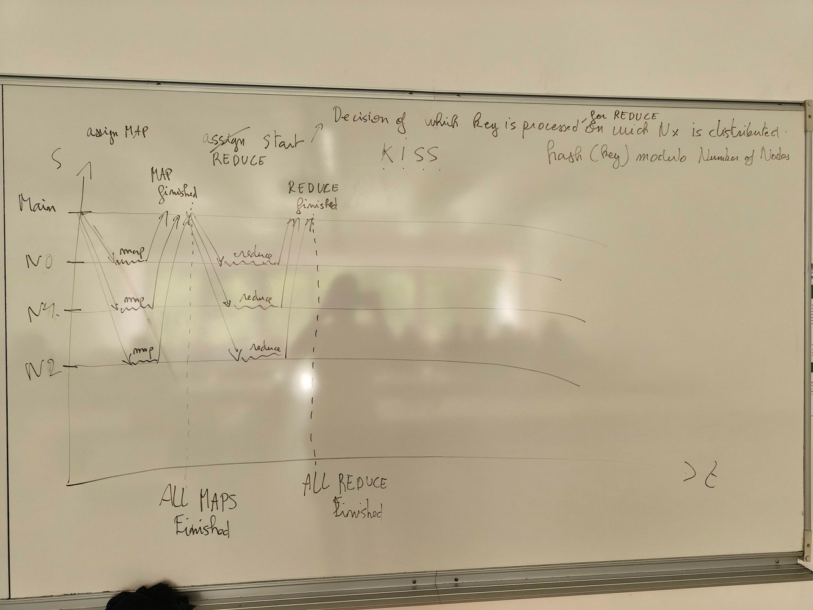

# Protocoles et MapReduce

Date : 22/05/2026

## 1. Objectifs de Développement et Scripts
* **Script de DÉPLOIEMENT :** Finaliser un script robuste capable de déployer les serveurs sur les machines cibles.
* **Script de NETTOYAGE :** Disposer d'un script robuste permettant de nettoyer l'intégralité des processus et fichiers déployés sur les nœuds.
* **Architecture Globale :** Concevoir le protocole de communication pour l'échange de signaux entre le nœud principal (**MAIN**) et les nœuds de calcul (**COMPUTE_NODES**) — *anciennement appelés MASTER/SLAVES ou MASTER/WORKERS*.

---

## 2. Analyse de la Publication MapReduce

### Référence
* **Titre :** *« MapReduce: Simplified Data Processing on Large Clusters »*
* **Auteurs :** Jeffrey Dean, Sanjay Ghemawat
* **Conférence :** OSDI'04: Sixth Symposium on Operating System Design and Implementation, San Francisco, CA (2004)

### Concepts clés à extraire
* **Architecture globale :** Comprendre l'organisation du système et acquérir une idée de base sur la synchronisation des différentes phases : **Map**, **Shuffle** (tri/regroupement) et **Reduce**.
* **Exemple concret :** Étudier l'exemple classique du calcul de la fréquence des mots (*word frequency*) appliqué à MapReduce.

---

## 3. Spécificités du Protocole et Conception

### Diagramme Espace-Temps
* Concevoir un diagramme espace-temps de la première version du protocole.
* **Contraintes :** Appliquer le principe **KISS** (*Keep It Simple and Stupid*), sans gestion de la tolérance aux pannes pour le moment.
* **Acteurs :** Inclure le nœud *Main* et plusieurs nœuds de calcul (*Workers*) identifiés par $N_0, N_1, N_2\dots$

### Formule de Distribution (Phase Reduce)
Pour déterminer quel nœud $N_x$ prend en charge une clé spécifique lors de la phase *Reduce*, on applique la formule de décision suivante :

$$\text{Index du N\oe ud} = \text{hash}(\text{clé}) \pmod{\text{Nombre de n\oe uds}}$$

Cette formule renvoie l'index du nœud de calcul responsable du traitement de cette clé.

### Gestion du Stockage (NFS vs Disque Local)
* **Constat MapReduce :** Comme indiqué dans la *Figure 1* de la publication, les sorties de la phase *Map* doivent être écrites dans un fichier intermédiaire sur le **disque LOCAL** de la machine.
* **Contrainte de l'école :** Le répertoire personnel (`HOME`) est hébergé sur un système **NFS** (Network File System) et non sur le disque local. Vous devez donc trouver une méthode technique pour forcer l'écriture des fichiers intermédiaires en local sur chaque machine.