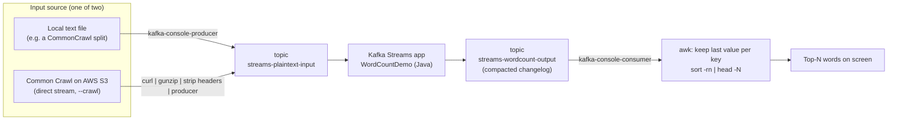
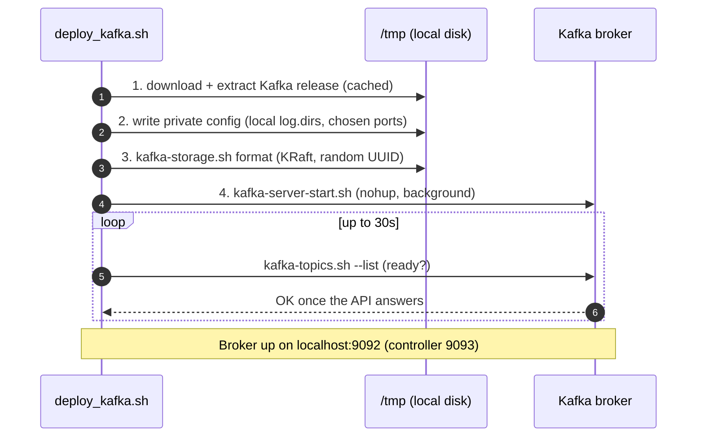
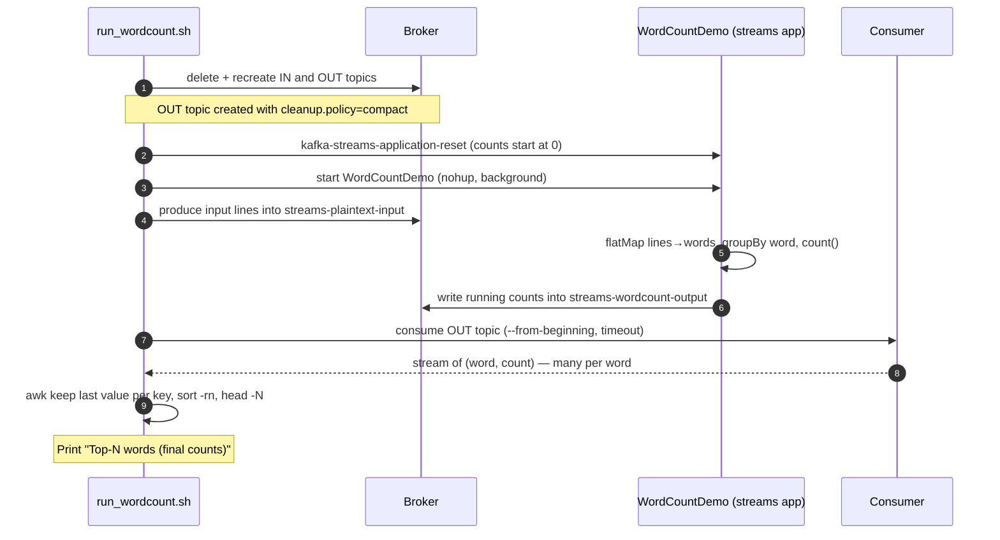
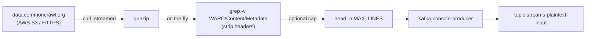

# Kafka Streams WordCount — How Our Implementation Works

> Screen-share this file in **VS Code Markdown Preview** (`Ctrl+Shift+V`). It is a
> self-contained walkthrough: the diagrams, real commands and real output below
> explain the whole implementation top to bottom.

---

## 1. The big idea: batch vs stream

Our main project is a **batch** system: it reads a *finite* input, produces *one*
final result, then **stops**. Kafka Streams is the **streaming** counterpart: it
reads a *never-ending* input and keeps a result that is **continuously updated**;
it never "finishes".

| | Our MapReduce (batch) | Kafka Streams (stream) |
|---|---|---|
| Input | finite (N splits) | unbounded (a topic) |
| Result | one final answer, then exit | a live value, updated forever |
| Word count of `the` | computed once at the end | re-emitted every time `the` arrives |
| Failure model | re-run lost tasks | offsets + changelog replay |

**The final counts are identical.** The difference is *operational*: Kafka keeps
the result alive and updates it as new data arrives.

---

## 2. What we actually built (and what we reused)

We did **not** write a stream processor. We **orchestrate the official Apache
Kafka** with three small Bash scripts, using KRaft mode — **no Docker, no root,
no ZooKeeper** (school-machine constraints). All state lives under `/tmp` (local
disk), so the **NFS is never touched**.

| File | Role |
|---|---|
| [deploy_kafka.sh](../../src/kafka/deploy_kafka.sh) | Download + start a single-node broker (KRaft) on `/tmp` |
| [run_wordcount.sh](../../src/kafka/run_wordcount.sh) | Create topics, run the WordCount app, feed input, print top-N |
| [commoncrawl_source.sh](../../src/kafka/commoncrawl_source.sh) | Stream a Common Crawl split **directly** into the input topic (no file) |
| `org.apache.kafka.streams.examples.wordcount.WordCountDemo` | The stream logic — **Apache's** prebuilt Java class, not ours |

---

## 3. Vocabulary (know these for the oral)

- **Broker** — the Kafka server. We run **one**, in **KRaft** mode (no ZooKeeper).
- **Topic** — a named, append-only log of messages (e.g. `streams-plaintext-input`).
- **Partition** — a topic is split into partitions for parallelism (here: **1**, it's a demo).
- **Producer** — writes messages into a topic (here: one text line per message).
- **Consumer** — reads messages from a topic (here: to print the top-N).
- **Changelog / compaction** — the output topic uses `cleanup.policy=compact`; each
  key (word) appears several times and the **last value is the final count**.

---

## 4. The end-to-end pipeline



Two ways to feed the pipeline:
1. **A local file** (default) — `kafka-console-producer` sends each line as a message.
2. **Direct Common Crawl** (`--crawl`) — our source connector streams the `.wet.gz`
   straight from Amazon, gunzips and strips WARC/HTTP headers **on the fly**, and
   produces each text line. **Zero intermediate files, NFS never touched.** This is
   the streaming analogue of our native `--direct-read`.

---

## 5. What `deploy_kafka.sh` does (4 steps)



Key points:
- **KRaft mode** = Kafka's own consensus for metadata, so **no ZooKeeper** process.
- Config is **copied and patched** (`sed`) so we never edit the shipped file:
  `log.dirs` → `/tmp`, `listeners` → chosen port, `controller.quorum.voters` → `1@localhost:9093`.
- Started with `nohup ... &` and the PID saved to `broker.pid` for clean teardown.

---

## 6. What `run_wordcount.sh` does (the demo)



The crucial detail — **why the `awk` step exists**:

```bash
# The output topic is a CHANGELOG: each key may appear several times,
# the LAST value is the final count. Keep last value per key, then sort desc.
awk -F'\t' 'NF==2 {last[$1]=$2} END {for (k in last) print last[k]"\t"k}' \
    | sort -rn | head -n "$TOP_N"
```

Because the output is a **compacted changelog**, the same word is emitted multiple
times with growing counts (`the→1`, `the→2`, … `the→900000`). We keep only the
**last** value per key to recover the final count, then sort.

### What it actually prints (real run)

```text
=================================================
 Kafka Streams WordCount demo
=================================================
Broker : localhost:9092
Input  : Common Crawl CC-MAIN-2024-10 #0 (direct stream, no file)

[OK] Topics streams-plaintext-input / streams-wordcount-output ready.
Starting WordCountDemo (log: /tmp/<user>-kafka/streams-wordcount.log) ...
Streaming Common Crawl CC-MAIN-2024-10 #0 directly into streams-plaintext-input ...
Waiting for the stream to process (15000 ms) ...

=================================================
 Top 20 words (final counts)
=================================================
the     38216
to      19043
of      18772
and     17984
a       16551
in      13298
for     10122
is       9430
...
```

These are the **same words** our batch MapReduce produces (`the`, `to`, `of`,
`and`, `a`, …) — the proof that the streaming path computes the identical result.

---

## 7. The direct Common Crawl → Kafka source (the elegant bit)



- The WET URL is resolved by streaming `wet.paths.gz`, gunzipping it, and taking
  the `(INDEX+1)`-th line — again **no temp file**.
- Everything is a **single shell pipeline**: `curl | gunzip | grep -v headers | head | producer`.
- This mirrors our native engine's `--direct-read`: the *batch* side streams from
  Amazon into RAM; the *stream* side streams from Amazon into a Kafka topic.
  **Nice symmetry to point out to the professor.**

---

## 8. How to run it live (3 commands)

```bash
# 1) Start a broker (local disk, no Docker/root)
bash src/kafka/deploy_kafka.sh

# 2a) WordCount on a text file...
bash src/kafka/run_wordcount.sh path/to/input.txt
# 2b) ...or stream a Common Crawl split straight in:
bash src/kafka/run_wordcount.sh --crawl CC-MAIN-2024-10 --index 0

# 3) Tear down (broker + topics + /tmp data)
bash src/kafka/clean_kafka.sh
```

---

## 9. Summary

- **What it is:** the *streaming* counterpart of our batch MapReduce. Same word
  counts; the difference is that Kafka keeps the result **live** and updates it as
  data arrives, instead of producing one final answer and exiting.
- **What we reused:** Apache Kafka's official `WordCountDemo` stream application.
- **What we built:** three Bash scripts that deploy a single broker in **KRaft mode
  on local disk** (no Docker, no root, no ZooKeeper, NFS untouched), run the demo,
  and clean up — plus a **source connector** that streams a Common Crawl split
  straight from Amazon into the input topic with **zero intermediate files**.
- **Why it matches the rest of the project:** the direct-from-Amazon streaming
  mirrors our native engine's `--direct-read`, and the final counts are identical
  to the batch output.
