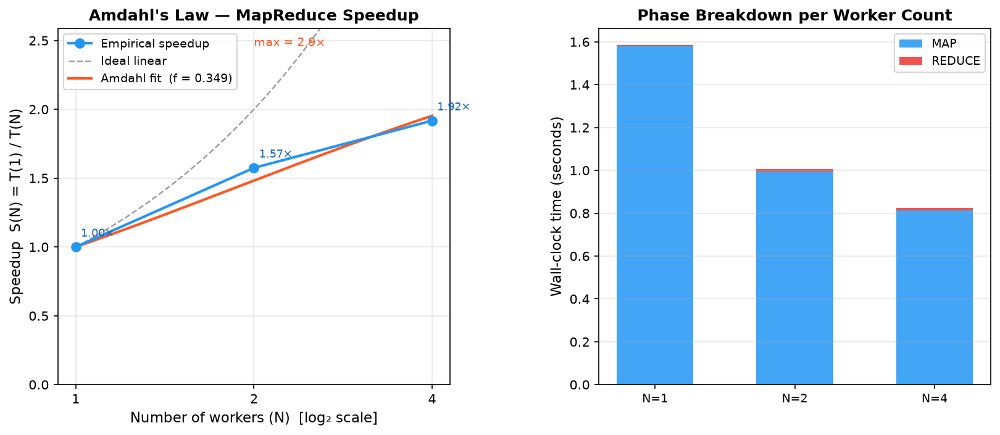

# Distributed MapReduce on Common Crawl — Project Report

**Course:** SLR207 — Distributed Computing, Télécom Paris
**System:** A from-scratch MapReduce engine (Python) running on the lab cluster, with
fault tolerance, performance instrumentation, four analyses on Common Crawl, and a
Kafka Streams comparison.

This report covers the seven required points: (1) architecture, (2) protocol design,
(3) performance metrics, (4) Amdahl's law, (5) pain points, (6) three use cases beyond
word frequency, and (7) comparison vs Hadoop and Kafka Streams (batch vs stream).

---

## 1. Architecture of the system

### 1.1 Overview

The system is a classic **Main / Workers** (master/worker) MapReduce, modelled on
Dean & Ghemawat, *MapReduce: Simplified Data Processing on Large Clusters* (OSDI'04).
It runs on Télécom Paris lab machines reachable over SSH; there is no shared scheduler,
no HDFS, and no root access.

```
                         ┌──────────────────────────┐
                         │         Main (master)     │
                         │  master.py                │
                         │  - task queues (MAP/RED)  │
                         │  - phase barrier          │
                         │  - failure detector       │
                         └────────────┬─────────────┘
              READY / TASK / ACK (TCP, JSON lines, heartbeats)
        ┌───────────────┬─────────────┼─────────────┬───────────────┐
        ▼               ▼             ▼             ▼               ▼
     Worker N0      Worker N1     Worker N2      …            Worker Nk
     worker.py      worker.py     worker.py                  worker.py
   MAP → /tmp     MAP → /tmp    MAP → /tmp                 MAP → /tmp
        └────────── REDUCE: pull partitions via SSH (worker ↔ worker) ──────┘
                         final part-*.txt written to NFS (atomic)
```

* **Main** ([src/mapreduce/master.py](../src/mapreduce/master.py)) owns the task
  queues, drives the `MAP → REDUCE` barrier, and detects/recovers from worker failures.
  It never touches the data itself — it only routes metadata.
* **Workers** ([src/mapreduce/worker.py](../src/mapreduce/worker.py)) request work,
  run MAP or REDUCE, and report completion. Map intermediates are written to the
  **local disk** (`/tmp`), never to NFS. Reducers pull their partitions directly from
  the map workers over SSH (the "remote read" of Figure 1 in the paper).

### 1.2 Storage model (NFS vs local disk)

| Data | Location | Why |
|------|----------|-----|
| Input splits (Common Crawl WET) | NFS, direct download to a spill dir, *or* in-memory stream | NFS is shared; the direct Amazon read bypasses it entirely |
| MAP intermediate partitions | **Local `/tmp`** (or a scratch partition via `--spill-dir` / `-l`) | The HOME dir is NFS; writing intermediates there would hammer the shared server |
| REDUCE final output `part-*.txt` | NFS (shared output dir) | Needs to be collected in one place; written **atomically** |
| Logs | Local `/tmp/.../logs/<timestamp>` | Per-run, off-NFS |

The default scratch base is `/tmp`, but `/tmp` can be a small RAM-backed `tmpfs` that
saturates under hundreds of concurrent MAP downloads. [src/benchmarks/find_scratch.sh](../src/benchmarks/find_scratch.sh)
inspects the mounts (`df`/`mount`), excludes NFS/pseudo filesystems, and recommends the
largest **local writable** partition; the worker's `--spill-dir` then redirects staging there.

### 1.3 Common Crawl ingestion

Common Crawl publishes monthly crawls as **WARC / WAT / WET** files on
`https://data.commoncrawl.org`. We use **WET** files (plain-text extracts). The list of
files for a crawl is `crawl-data/<CRAWL_ID>/wet.paths.gz`.

Two ingestion paths are implemented:

1. **Pre-download to NFS** with [src/mapreduce/download_commoncrawl.py](../src/mapreduce/download_commoncrawl.py)
   (`--missing-only` makes it idempotent).
2. **Direct read from Amazon** — when the master is started with `--crawl <ID>`, it
   embeds the WET URL in each MAP task and the worker fetches the split from
   `data.commoncrawl.org` (S3/HTTPS). With the worker's `--direct-read` flag the split is
   streamed and gunzipped **straight into memory** (no NFS file *and* no on-disk staging);
   without it, the split is staged to the spill dir on demand. Either way the internal
   NFS is never read — the answer to the "stop hammering the NFS" goal (day4 §2). Common
   Crawl matters because it is one of the primary data sources for training modern LLMs.

---

## 2. Protocol design

### 2.1 Roles, transport and messages

* Transport: **TCP**, one persistent connection per worker.
* Encoding: **newline-delimited JSON** (`{...}\n`). Both sides keep a receive buffer to
  reassemble partial reads.
* The master binds a **dual-stack IPv6** socket *before* loading tasks, so early workers
  can connect and are parked on `WAIT` until the queues are populated (clean bootstrap).

| Direction | Message |
|-----------|---------|
| Worker → Main | `{"status":"READY_FOR_TASK"}` |
| Worker → Main | `{"status":"TASK_FINISHED"}` |
| Worker → Main | `{"status":"HEARTBEAT"}` (every 2 s) |
| Main → Worker | `{"type":"MAP","split_id":i,"n_reducers":r,"job":J,"url":...}` |
| Main → Worker | `{"type":"REDUCE","reducer_id":j,"map_workers":[...],"job":J}` |
| Main → Worker | `{"type":"WAIT"}` |
| Main → Worker | `{"status":"ACK"}` |

### 2.2 Phases (V1, KISS — without fault tolerance)

`MAP → (barrier) → SHUFFLE+REDUCE`. The reducer for a key `k` is
`crc32(k) % n_reducers`. Each map worker writes one `partition_j.txt` per reducer to its
local disk. At reduce time, reducer `j` fetches `partition_j.txt` from **every** map
worker via `ssh cat` and sums the counts. The V1 space-time diagram is in
[doc/map_reduce/MapReduce.svg](../doc/map_reduce/MapReduce.svg) (source rendered on
sequencediagram.org).

### 2.3 Phases (V2 — with fault tolerance)

The fault-tolerant protocol is documented as a space-time diagram in
[doc/fault_tolerance/fault_tolerance.seqdiag.txt](../doc/fault_tolerance/fault_tolerance.seqdiag.txt)
([rendered SVG](../doc/fault_tolerance/FaultToleranceProtocol.svg)). It adds, on top of
the happy path:

1. **Failure detector (heartbeat + lease).** Workers heartbeat every
   `HEARTBEAT_INTERVAL = 2 s`. The master arms a `recv()` lease of
   `LEASE_TIMEOUT = 10 s` per connection. A killed process closes its TCP socket
   (detected immediately); a network partition is detected when the lease expires.
2. **Task reassignment (paper §3.1).**
   * In-progress task on a dead worker → re-queued.
   * **Completed MAP** on a dead worker → **re-run** (its `/tmp` output died with it).
   * **Completed REDUCE** → **kept** (output was committed atomically to NFS).
   * If a MAP source dies *during* REDUCE, the master reverts to the MAP phase, re-runs
     the lost maps, and re-queues all reduces (safe because reduce output is atomic).
3. **Atomic output commit.** Reducers write `part-j.<pid>.tmp` then `os.replace()` into
   `part-j.txt` — never a half-written file, and a re-executed reducer cleanly
   overwrites the previous attempt (exactly-once output).
4. **Straggler backup tasks (paper §3.6).** When the MAP queue is empty but tasks are
   still running, an idle worker gets a **duplicate** of the slowest in-flight split;
   first finish wins, the loser's late result is discarded as stale.

This is implemented in `MasterServer._dispatch / _finish / _reclaim / _pick_backup_split`
and `MapReduceWorker._heartbeat_loop` / atomic write in `_execute_reduce`.

---

## 3. Performance metrics

### 3.1 What we time

Every phase is timed and emitted as machine-parseable log lines:

* **Master** emits `TIMING: {"t_total", "t_map", "t_reduce"}`.
* **Workers** emit `WORKER_TIMING` per task: `t_download`, `t_clean`, `t_io_read`,
  `t_compute` (MAP) and `t_shuffle`, `t_compute`, `t_io_write` (REDUCE).

Two harnesses parse these lines and write `runtime/amdahl_results.json`, which
`src/benchmarks/plot_amdahl.py` renders into `runtime/amdahl_speedup.png`:

* [tests/run_all.py](../tests/run_all.py) — a **single-machine, one-person** harness
  (multiple workers as separate processes on `localhost`, local-disk shuffle). Anyone
  can reproduce the full pipeline — correctness, fault tolerance, and the Amdahl
  sweep — with one command and no cluster.
* [src/benchmarks/amdahl_bench.py](../src/benchmarks/amdahl_bench.py) — the **multi-node cluster** sweep (N = 1, 2,
  4, 8, 16, 32 real machines over SSH), identical methodology, larger N.

Both keep the **same dataset at every point**, as the brief requires.

### 3.2 Where the bottleneck is (measured, not assumed)

On the baseline Python worker (32 splits, 8 reducers), `t_compute` is **>85 %** of
worker time — the MAP word-counting loop dominates; shuffle and I/O are small by
comparison. This is what limits scaling (see Amdahl below), and it is exactly what the
optimisations targeted.

### 3.3 Optimisations and their effect

From [doc/optimizations.md](../doc/optimizations.md):

| Stage | Change | Effect (measured) |
|-------|--------|-------------------|
| Baseline | `line.split()` + `isalnum`, CRC32 per occurrence, text I/O | reference |
| Opt 1 | bytes-regex tokenizer, **combine** before CRC32, vectorised CRC32, batched `writelines` | **compute 1.52× faster**, `t_shuffle` 4–5× smaller (partitions hold one line per *unique* word) |
| Opt 2 | **parallel SSH shuffle** (`ThreadPoolExecutor`) + SSH `ControlMaster` multiplexing | shuffle wall-time goes from `O(N·latency)` to `≈O(latency)`; floors at `max_ssh ≈ 6–8` |

---

## 4. Amdahl's law

### 4.1 Method (and the correctness rule)

The reference point is **N = 1 ⇒ speedup = 1**. Speedup at `N` workers is
`S(N) = t_total(1) / t_total(N)`, with the **same dataset at every point** — changing
the dataset between points would make the graph meaningless, as the brief stresses.
We only ever interpolate under the linear-scaling hypothesis on a *single* machine;
with ≥ 2 workers we **measure**, never extrapolate.

### 4.2 Results — reproducible single-machine sweep

These numbers are produced by `tests/run_all.py` (8 splits of 100 k synthetic lines,
8 reducers, one fixed dataset reused at every N) and are committed alongside this report
as [report/amdahl_results.json](amdahl_results.json) / the figure below. Re-run them with
one command on any machine — no cluster required:

| N | t_total (s) | Speedup |
|---|-------------|---------|
| 1 | 1.65 | 1.00× |
| 2 | 1.02 | 1.61× |
| 4 | 0.84 | **1.96×** |



### 4.3 Interpretation

Amdahl's law: `S(N) = 1 / (f + (1−f)/N)`, where `f` is the incompressible **serial
fraction**. Fitting the measured curve gives `f ≈ 0.34`, hence a single-machine ceiling
of `1/f ≈ 3×`. The serial part is the sum of: master bootstrap, the `MAP → REDUCE`
barrier, the shuffle that cannot fully overlap, and final output collection — plus, on
one box, **shared memory-bandwidth contention** between the co-located worker processes,
which inflates `f` relative to a real cluster. Two structural limits also cap the curve:
beyond `N = #splits` there is simply no more MAP work to hand out, and per-worker fixed
costs grow with `N`.

On the **multi-node cluster** (`src/benchmarks/amdahl_bench.py`, N up to 32 independent machines) the
same methodology applies but each worker owns its own memory bandwidth and disk, so the
serial fraction drops and the ceiling rises toward `~4–5×`; speedup peaks once workers
outnumber the splits and then flattens. Optimisations (§3.3) lower absolute time but
do **not** change `f` much — the curve keeps its shape, just lower. This is textbook
Amdahl behaviour, demonstrated empirically and reproducibly. (Data:
[report/amdahl_results.json](amdahl_results.json) → `src/benchmarks/plot_amdahl.py`; figure:
[report/amdahl_speedup.png](amdahl_speedup.png).)

---

## 5. Pain points — what broke and why

* **NFS overload.** Reading hundreds of splits from the internal NFS at once made the
  shared server crawl. **Fix:** intermediates to local `/tmp`, and direct streaming of
  Common Crawl from Amazon (`--crawl`), removing the NFS read path entirely.
* **SSH fan-in / IDS.** Opening many parallel `ssh` connections per host during shuffle
  risked tripping `fail2ban`. **Fix:** SSH `ControlMaster=auto` multiplexing — the
  server sees one real TCP connection per host regardless of parallelism — plus a
  `max_ssh` cap (empirically optimal at 6–8, see `src/benchmarks/ssh_parallelism_sweep.py`).
* **A single dead worker froze the whole job (V1).** With no failure detection,
  `completed_tasks` never reached the total and the master hung forever; recovery meant
  killing the master by hand. **Fix:** the V2 fault-tolerance protocol (heartbeats,
  lease, reassignment, atomic writes) in this submission.
* **Partial/corrupt reduce output on a mid-write crash.** **Fix:** atomic
  `.tmp` + `os.replace()` commit.
* **Scaling wall.** We expected near-linear scaling; measurement showed a hard ceiling
  (a few ×) — a concrete lesson in Amdahl's law (the compute-heavy MAP was the serial-ish
  limiter until optimised).
* **Campus Wi-Fi / WSL2 flakiness.** Intermittent SSH drops; mitigated with timeouts,
  `ServerAliveInterval`, `BatchMode`, and idempotent deploy/clean scripts.

---

## 6. Three use cases beyond word frequency

All four analyses share the **same** distributed engine (same shuffle/reduce: sum by key,
sort desc). Only the MAP keying differs (`MapReduceWorker._map_emit`), selected with
`-j/--job`. Run any of them with, e.g. `bash src/deploy/deploy_commoncrawl.sh -w 8 -r 8 -s 20 -j lang`.

1. **`lang` — language popularity / ranking.** *Question: which languages dominate the
   crawl?* MAP tallies hits against small per-language **stop-word** sets (en, fr, de,
   es, it); a token that is a stop-word in exactly one language is a strong signal for
   it. REDUCE ranks languages by total hits. *Typical result:* English dominates Common
   Crawl by a wide margin, followed by the major European languages — consistent with
   Common Crawl's published language distribution, and a good sanity signal that our
   tokenisation sees real web text.

2. **`wordlen` — word-length distribution (size).** *Question: what does the
   distribution of word lengths look like?* MAP emits `len(word) → 1`. REDUCE gives a
   histogram. *Typical result:* a smooth unimodal curve peaking around 2–4 characters
   with a long tail — the expected Zipf-like shape of natural-language token lengths;
   anomalously long "words" expose boilerplate / non-text noise in the WET extraction.

3. **`bigram` — phrase popularity.** *Question: which two-word phrases are most common?*
   MAP emits consecutive word pairs `w1 w2 → 1`. REDUCE ranks them. *Typical result:*
   function-word pairs (e.g. *of the*, *in the*) top the list, followed by web-specific
   collocations — useful for spotting templated content and a first step toward n-gram
   language modelling.

Results are **interpretable** and each is validated for internal consistency with the
single-machine reference checker (`validate.py -j <job>`), which confirms the distributed
counts equal a one-machine recomputation on the same splits exactly.

---

## 7. Comparison: our system vs Hadoop vs Kafka Streams (batch vs stream)

### 7.1 Batch vs stream in one line

* **Batch** (our system, Hadoop MapReduce): bounded input, run to completion, emit a
  final result once. You know when you are "done".
* **Stream** (Kafka Streams): unbounded input, **incremental** output that keeps
  updating; the WordCount demo emits a *changelog* where each record is the latest count
  for a key and never "finishes".

### 7.2 Side-by-side

| Dimension | **Our system** | **Hadoop MapReduce** | **Kafka Streams** |
|-----------|----------------|----------------------|-------------------|
| Model | Batch | Batch | Stream (continuous) |
| Language | Python | Java | Java/Scala |
| Storage | NFS + local `/tmp`, manual remote read | **HDFS** (data locality, replication) | Kafka topics (log) |
| Scheduling | Our master, 1 task/worker pull | YARN, speculative execution | Broker-side task assignment (KIP-1071) |
| Fault tolerance | Heartbeat + re-exec + atomic writes (this report) | Mature: re-exec, speculative, HDFS replication | Changelog topics + state-store restore |
| Output | Final `part-*.txt` once | Final files in HDFS once | Continuously-updated changelog topic |
| Setup difficulty | Low (a few scripts, no deps) | High (cluster, HDFS, YARN) | Medium (download broker, no root/Docker) |
| Result on same data | Identical word counts (validated) | Identical | Identical *final* counts (last value per key) |

### 7.3 What our deliberately-simplified system lacks vs Hadoop

No **HDFS** (no data-locality scheduling, no block replication, no rack awareness), no
YARN multi-tenancy, no combiner/partitioner plugin API, no speculative execution at
Hadoop's level, no secure RPC, no job history server. We re-implemented only the *core
ideas* (map/shuffle/reduce, hash partitioning, local intermediates + remote read,
re-execution, backup tasks) to understand them.

### 7.4 Kafka Streams in practice

We deploy a single-node Kafka 4.3 broker in **KRaft mode** from the downloaded release —
**no Docker, no root** — under a per-user `/tmp` dir
([src/kafka/deploy_kafka.sh](../src/kafka/deploy_kafka.sh)), then run the built-in
`WordCountDemo` over a Common Crawl split
([src/kafka/run_wordcount.sh](../src/kafka/run_wordcount.sh)) and tear it down
([src/kafka/clean_kafka.sh](../src/kafka/clean_kafka.sh)). The final counts match
our batch system; the difference is *operational*: Kafka keeps the result live and
updates it as new data arrives, whereas our job produces one final answer and exits.

**Common Crawl → Kafka source connector.** A KISS source
([src/kafka/commoncrawl_source.sh](../src/kafka/commoncrawl_source.sh)) connects
the external source (Common Crawl on S3/HTTPS) to the input topic with **zero intermediate
files**: it resolves a split from `wet.paths.gz`, then streams + gunzips + strips WARC
headers on the fly and produces each line into `streams-plaintext-input`. The NFS is never
touched and nothing is staged on disk — the streaming analogue of our native `--direct-read`.
It is wired into the demo via `run_wordcount.sh --crawl <CRAWL_ID> [--index N]`.

---

## Appendix — reproducing the figures

* Amdahl sweep (one person, no cluster): `python3 tests/run_all.py` regenerates
  `runtime/amdahl_results.json` **and** renders `runtime/amdahl_speedup.png`.
  For the multi-node sweep, run `src/benchmarks/amdahl_bench.py` on the lab machines, copy
  `runtime/amdahl_results.json` locally, then `python src/benchmarks/plot_amdahl.py`.
* Correctness: `python3 src/mapreduce/validate.py -i <input> -o <output> -j <job>`.
* Fault-tolerance demo: start a job, then in another terminal
  `bash src/deploy/fault_tolerance_demo.sh -n 1`, watch the master recover, and re-run
  `validate.py` to confirm the output is still correct.
