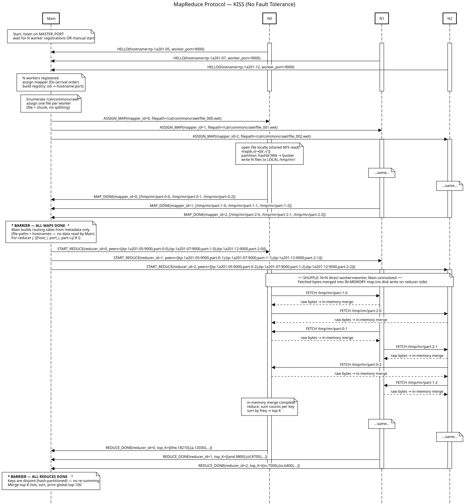

# Distributed MapReduce on Common Crawl
### SLR207 — Télécom Paris · Group 1

A from-scratch **MapReduce engine** running on the school cluster — no Hadoop,
no HDFS, no YARN, no root rights.

Built around one question: *how do you process gigabytes of web text across
dozens of shared machines, correctly and fast, when one of them can die at any
moment?*

---

## What we built (in one slide)

- A **Main + Workers** distributed engine deployed over **SSH** on `tp-*.enst.fr`.
- Runs **word frequency** + **3 other analyses** on **Common Crawl** web data.
- **Fault tolerant**: kill a worker mid-job, the job still finishes with the *exact* right answer.
- **Measured** performance and a real **Amdahl's law** curve (1 → 16 nodes).
- A **Kafka Streams** counterpart, to compare *batch* vs *stream*.

> Everything reproducible from the repo; a one-laptop fallback exists for the demo.

---

## Agenda — the questions we kept asking

1. Team & method
2. Discovery & deployment (SSH, ports, cleanup)
3. **NFS vs local disk** — the critical decision
4. Architecture & protocol (Main / Workers)
5. MapReduce core & correctness
6. The data: Common Crawl
7. Performance & Amdahl's law
8. Fault tolerance
9. Batch vs stream: us vs Hadoop vs Kafka
10. Use cases & pain points

---

## 1. Team & method

- Work split by **responsibility**: deployment, protocol, map/reduce core,
  metrics/Amdahl, fault tolerance, Kafka — each owned, but cross-reviewed.
- **Protocol formalized first** on *sequencediagram.org* — we did **not** code blindly.
- Shared **Git repository** + shared notes for findings and progress.
- **Everyone** can deploy, run, validate and clean the system — not a single person.
- Kafka Streams started early, not left to the last minute.

---

## 2. Discovery & deployment

- Machines from the **`tp.telecom-paris.fr` API** (the `ajax.php` JSON the browser fetches).
- We use **canonical names** (`tp-1a201-05.enst.fr`) and test **liveness** by SSH (timeout) — a powered-off machine is skipped, never blocks us.
- **One SCP to the NFS HOME, then N SSH** to launch servers — *not* N SCP.
  The home is shared over NFS, so a single copy is visible everywhere → far less traffic.
- **Port selection** is configurable; if taken, we pick another. Dual-stack listener.
- **SSH keys + fingerprint bypass** → no password, no interactive "yes".
- A **cleanup script** kills *only our* processes (UID-scoped) on every node → clean redeploy.

---

## 3. NFS vs local disk — the critical point

- Our **HOME is on the NFS**, not the local disk. Writing there hammers a shared server.
- The paper (Fig. 1) writes **map intermediates to the LOCAL disk** — so do we: **`/tmp`** on each worker.
- We **explore** each machine (`df`, `mount`) for the largest local scratch partition.
- Why it matters:
  - **Performance** — local I/O instead of network I/O.
  - **Politeness** — hundreds of concurrent reads would crush *"the poor little NFS server"*.
- Only the **final output** lands back on the NFS, written **atomically**.

---

## 4. Architecture

- **Main (coordinator)**: holds the MAP/REDUCE task queues, the **phase barrier**, and the **failure detector**. It routes **metadata only** — never the data itself.
- **Workers**: do the MAP locally, then **pull** each other's partitions for REDUCE.
- The **shuffle is the "remote read"**: worker ↔ worker, directly, Main uninvolved.

> Full protocol incl. fault tolerance: `doc/fault_tolerance/fault_tolerance.seqdiag.txt` (sequencediagram.org).

---

## 4. Protocol (V1, KISS first)

- Transport: **TCP**, newline-delimited **JSON**, one connection per worker.
- Conversation: `READY → {MAP | REDUCE | WAIT} → TASK_FINISHED → ACK`.
- **Phase sync**: the Main starts REDUCE only when **all** MAP tasks are DONE (barrier).
- **Bootstrap** (chicken-and-egg): Main listens first; workers connect, register, and *ask* for work — no fixed worker list baked in.
- **Key routing**: reducer for key `k` = `crc32(k) % R` → every occurrence of a key lands on the **same** reducer.

---

## 5. MapReduce core — word frequency

- **MAP**: read a split → tokenise → emit `(word → 1)`, pre-combined locally per split.
- **Partition**: `crc32(word) % R` buckets, written to local `/tmp`.
- **REDUCE**: fetch all buckets for its partition, **sum per key**, sort, write `part-j`.
- The hash guarantees **disjoint keys** per reducer → no global re-summing at the end.

### Are the results correct?

- **Sanity check**: pairs-in vs pairs-out.
- **Ground truth**: a **single-machine** recomputation on the *same* splits — same distinct keys, same totals, **key-by-key** equality.

---

## 6. The data: Common Crawl

- Real web crawl in **WET** (extracted plain-text) format; file list via `wet.paths.gz`.
- We grew the scale deliberately: **toy split (PoC) → real splits → 16 splits (~1.5 GB)**.
- Two ingestion paths:
  - pre-download splits to the NFS, **or**
  - **stream directly from Amazon S3/HTTPS** to each worker's `/tmp` — **NFS untouched**.
- Why Common Crawl? It's one of the **primary data sources for training today's LLMs**.

---

## 7. Performance — measure, don't guess

- We time **every phase**: deploy, clean, file read/write, sync/wait, network, compute.
- **Bottleneck (measured, not assumed):** the MAP **compute** dominates worker time.
- Optimisations that moved the needle:
  - bytes-level tokeniser + **local combine** → smaller shuffle,
  - **vectorised CRC32** partitioning,
  - **parallel SSH shuffle** with connection multiplexing.

---

## 7. Amdahl's law (real cluster)

Same 16-split dataset at **every** point — one run per node count:

| N nodes | t_total | Speedup |
|---------|---------|---------|
| 1 | 521.7 s | 1.00× (reference) |
| 2 | 262.8 s | 1.99× |
| 4 | 137.2 s | 3.80× |
| 8 | 84.6 s | 6.17× |
| 16 | 67.4 s | **7.74×** |

- Incompressible **serial fraction f ≈ 0.065** → theoretical ceiling **≈ 15.4×**.
- Linear to N=4, then shuffle / SSH fan-in bends the curve.
- With ≥2 nodes you **must measure** — extrapolation from one machine is invalid.

---

## 8. Fault tolerance — the core challenge

- **Detection**: heartbeats (2 s) + **lease (60 s)**, *and* instant TCP-close detection.
- **Re-execution** (paper §3.1):
  - a **completed MAP** on a dead node is **re-run** — its `/tmp` output is gone,
  - a **completed REDUCE** is **kept** — it was committed atomically on the NFS,
  - any in-progress task is re-queued.
- **Stragglers**: backup tasks duplicate the slowest map; first to finish wins.
- **Atomic writes**: `.tmp` then rename → no partial/duplicate output (exactly-once).
- **Main failure**: periodic checkpoint → resume from the last barrier.

---

## 8. Fault tolerance — demonstrated

We killed a worker **mid-MAP** during a 16-split job:

- Main logged **`Worker disconnected`** → its lost MAP was **reassigned**,
- all 16 maps completed, REDUCE ran on the 7 survivors → **`job finished`**,
- re-validated against the single-machine reference: **PASS, exactly correct**
  (`distinct = 9 465 561`, `total = 571 949 216`).

> Fault tolerance isn't just "it finishes" — it finishes with the **right answer**.

---

## 9. Batch vs stream — us vs Hadoop vs Kafka

| | Our system | Hadoop | Kafka Streams |
|---|---|---|---|
| Model | Batch | Batch | **Stream** |
| Storage | NFS + local `/tmp` | **HDFS** | Kafka log |
| Output | final, once | final, once | **changelog (live, never "done")** |
| Setup | light (SSH) | heavy | medium (no root / no Docker) |

- We deliberately **don't** have: HDFS, YARN, speculative exec, secure RPC.
- Kafka WordCount gives the **same counts**, but keeps updating continuously.
- Idea: a **Common Crawl → Kafka source connector** reads S3 straight into a topic — no NFS, no files.

---

## 10. Three use cases (same engine)

Same shuffle/reduce — only the MAP keying changes:

- **Languages** — dominant languages via stop-word hits → English leads.
- **Word length** — distribution of word sizes → unimodal, peak ~2–4 chars.
- **Bigrams** — phrase popularity → function-word pairs dominate.

Each result is **interpretable** and **validated** against a single-machine reference.

---

## 10. Pain points — what broke & why

- **NFS overload** under concurrent reads → moved intermediates to local `/tmp` + direct S3 read.
- **SSH fan-in / fail2ban** when launching many nodes → connection multiplexing + bounded parallelism.
- **One dead worker froze the whole V1 job** → V2 heartbeats + re-execution.
- **Partial output on crash** → atomic commit (temp + rename).
- **"Why only a few ×?"** → Amdahl's law, learned the hard way by measuring.

---

## What we proved

- A working **distributed MapReduce** on real Common Crawl data.
- **Correctness** verified against a single-machine ground truth.
- **Fault tolerance** demonstrated by killing a node mid-job — still exact.
- A **real Amdahl curve** (7.74× on 16 nodes, ceiling ≈ 15.4×).
- A **Kafka Streams** comparison framing batch vs stream.

Repo: `README.md` (run from scratch) · `report/` · `doc/fault_tolerance/fault_tolerance.seqdiag.txt` · `self-assessment.md`

---

## Thank you — questions?

**Demo on request:** deploy a job, kill a worker live, show it recover and still
produce the exact same counts as a single-machine reference.

